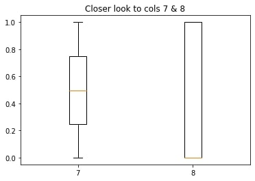
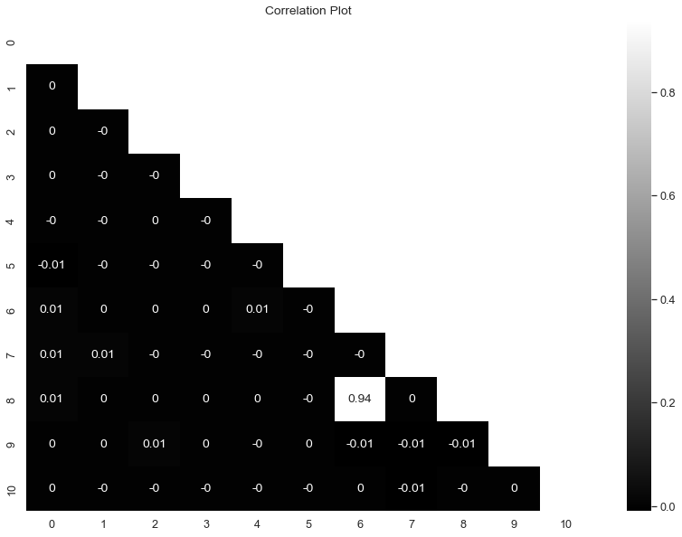
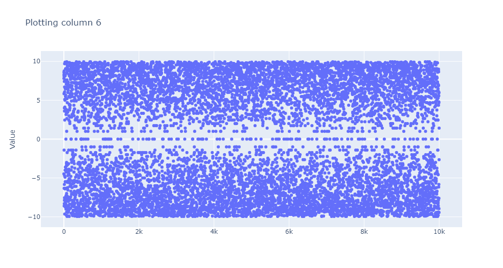
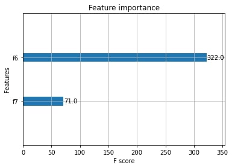
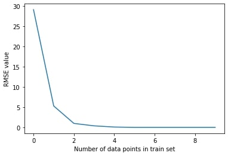

# Regression_on_the_tabular_data
## Description
Analyzed given dataset and build a regression model. Predictions for internship_hidden_test.csv file can be found [here](test_with_predicted_target.csv).
First and second test tasks are [in this notebook](Tasks_1_and_2/Quantum_DS_Test_Tasks(1-2).ipynb).
## Analysis
Given dataset has got 53 anonymized features and a target column. There are no missing values or repeated rows in both test and train datasets. Box plots show no outliers
&nbsp;

&nbsp;

&nbsp;

Correlation plots only show significant correlation between two features (6 and 8)
&nbsp;

&nbsp;

Plotting column 6:
&nbsp;

&nbsp;

Column 8 actually has only two unique values: 0 and 1 

## Feature Importance and Regression Model
Feature elimination can actually be quite tricky. Removing any data from dataset needs to be done very carefully, ecpesially considering the fact that actual features' natrue is unknown.
&nbsp;

An XGBoost model was built to examine feature importance. 
&nbsp;

&nbsp;

As the model showed, only two features are actually useful to build a model that can predict target value well. So 2 degree Polynomial Regression was built using only  2 features out of 53 (columns '6' and '7').
## Results
2 degree Polynomial Regression model results:
&nbsp;

**RMSE :  0.000000**

&nbsp;

***Fun fact***
&nbsp;

The model prefectly learns data patterns given 5 data points or more.
&nbsp;

Meaning that e.g. 1 out of 90000 data points (rows) from train.csv file are in the train set - the rest 89999 data points (rows) are in the test set, on which model's RMSE is calculated
&nbsp;

