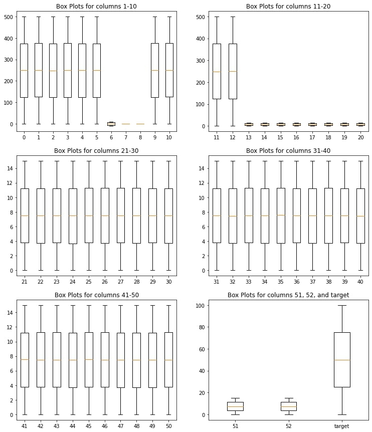

# Regression_on_the_tabular_data
## Description
Analyzed given dataset and build a regression model. Predictions for internship_hidden_test.csv file can be found [here](test_with_predicted_target.csv).
First and second test tasks are [in this notebook](Tasks_1_and_2/Quantum_DS_Test_Tasks(1-2).ipynb).
## Analysis
Given dataset has got 53 anonymized features and a target column. There are no missing values or repeated rows in both test and train dataset. Box plots show no outliers. 

